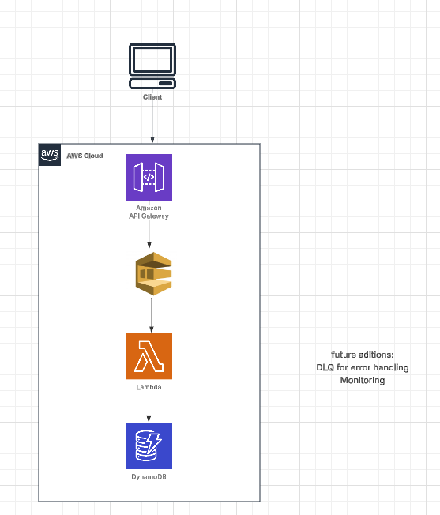

# Screencloud Telemetry Challenge

## Solution Overview

This project implements a serverless application using AWS Lambda and DynamoDB to manage drone telemetry data. The solution aimed on using lambda for efficient data processing and dynammoDB for event storage while maintaining scalability and reliability.


### Architecture Flow

1. Drone events trigger a Lambda function
2. The Lambda function:
   - Validates incoming drone data
   - Processes and transforms it into JSON format
3. Valid rows are stored in the dynamoDB table and can be quried quickly 



### Technical Stack

- **Architecture:** AWS Serverless
- **Language:** TypeScript
- **Database:** DynamoDB
- **Local Development:** Docker and Express 
- **Testing:** Test-Driven Development approach
- **Infrastructure:** AWS CDK

## Getting Started

### Prerequisites

- Node.js and npm installed
- Docker installed (for local DynamoDB)
- AWS CLI configured (for deployment)

### Installation and Setup

1. Install dependencies:
   ```bash
   npm install
   ```

2. Start local DynamoDB:
   ```bash
   docker compose up
   ```

3. Run setup local dynamo db script
   ```bash
    npx ts-node scripts/setup-local-dynamodb.ts
   ```

4. Run generate test data script
   ```bash
    npx ts-node scripts/generate-test-data.ts
   ```

5. Run local server
   ```bash
    npx ts-node scripts/local-server.ts
   ```

### Additional Commands

| Command | Description |
|---------|-------------|
| `npm run build` | Compile TypeScript to JavaScript |
| `npm run watch` | Watch for changes and recompile |
| `npm run test` | Run Jest unit tests |
| `npx cdk deploy` | Deploy stack to AWS |
| `npx cdk diff` | Compare deployed stack with current state |
| `npx cdk synth` | Generate CloudFormation template |

## Development Notes

### Design Considerations

While AWS Step Functions was initially considered as a potential solution, the decision was made to focus on Lambda functions due to my experience and simplicity of implementation.

I also wanted to use dynamo as I thought it would be most suitable to store the telemetry data, especially when querying. Dynamo also supports streaming events which I believe to be a good solution to this  problem. eg events could be triggered based ona particular item changing in the telemetry data 


### Challenges and Learnings

I was having trouble with the lambda> dynamo call locally due to security tokens in docker, I set up a express sever to run locally so that i could hit the POST endpoint for testing

The main challenge encountered was setting up DynamoDB for local development:
- Successfully configured local DynamoDB using Docker
- Faced difficulties integrating the process Lambda with the local DynamoDB container for testing
- In retrospect, while DynamoDB remains the ideal choice for this use case, using a familiar relational database like PostgreSQL might have accelerated initial development   
- I pivoted form connecting to the docker container to mocking th Dynamo db instance using aws-sdk-mock library here https://github.com/dwyl/aws-sdk-mock/blob/main/README.md 

As dynamo was causing issues I decided to pivot and have the process lambda parse and validate the data 
and prepare it for sending to dynamo 

   { "row": "drone001,1747209660000,FLYING,ACTIVE,22,belfast",
                "error": "Row processing failed: UnrecognizedClientException: The security token included in the request is invalid."
            },


Learnings
A change in tech stack can bring with it some upskilling opportunities, however this challenge helped me realise potential gaps in my knowledge for me to improve on. 

In my experience we have always ran the api stack remotely I have learned about the additional setup required for backend local dveelopment 